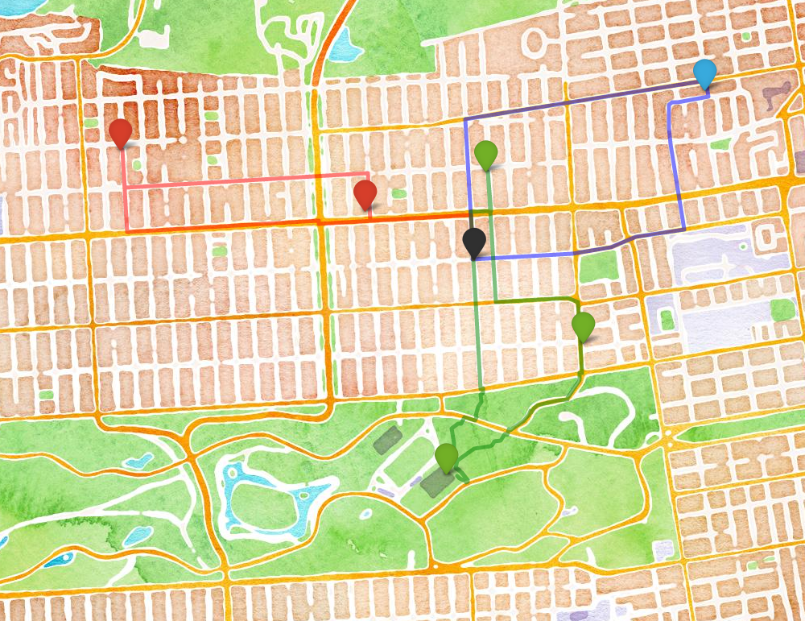

[Live Version!](optimize_stops_3_people_walk.html)

### Traveling Salesman Problem

The traveling salesman problem is a classic optimization problem that seeks to find the most efficient route to connect a given set of points. I recently discovered a set of services built by the open-source mapping company, Mapzen that make this complex problem easy to approximate for a relatively small numbers of stops. Given a set of coordinates, the Mapzen [optimize route](https://mapzen.com/documentation/mobility/optimized/api-reference/) service uses road network data to produce a time-distance matrix between these points, and then uses an optimization algorithm to determine a route that minimizes total travel time. This can be done for one of three modes of transportation - pedestrian, bicycle, and automobile. They have a great [example](https://mapzen.com/blog/optimized-route/) with a cool map where they determine the optimal route to visit burrito 'dispensaries' in San Francisco.

This optimization tool can also be used in conjunction with Mapzen's [Search](https://mapzen.com/documentation/search/) Service, which uses open source data to geocode addresses, landmarks, and businesses. Using these two services together is really handy, because it means that one can pass a list of addresses or business names rather than lat / long coordinates.


### Building Off the Optimize Route Service
The Mapzen optimize route service takes a set of points and finds the optimal route that a person should take to visit all of these points. However, what if we have multiple "salesmen?” How should the stops be split up between people and in what order should each person visit their stops?

The idea for this was spurred by a project I'm involved with at work, in which we are sending out multiple research assistants to conduct surveys at a dozen or so different sites in Oakland. In this case, it doesn't matter if one person conducts more surveys than the others  or who goes to which site - the goal is just to minimize the total time to get them all done.

I decided to test these services in an application that hits closer to home (literally): the optimization of Sunday morning errands between my girlfriend, Celeste, and I. Say we're both starting and ending at our apartment in the Inner Richmond, SF and have 6 different places that we need to stop at. How should Celeste and I split up these errands so that we're finished as quickly as possible?

In the post below, I write a set of functions in Python that call the Mapzen Search and Mapzen Optimize Route API services, making it really easy to determine the most efficient route between a given set of locations. I also extend this function to determine the most efficient way to split the stops among multiple salesmen, and which route each person should take.

Additionally, I use the Python package ```folium``` to create leaflet.js slippy maps to display the results of this optimization problem. Folium has a number of built-in tilesets from OpenStreetMap, MapQuest, MapBox, and makes it really easy to build web maps using Python. I find this package to be really useful for data visualization – since I tend to generate data in Python anyway it’s nice to be able to do it all within one work environment.

### A Few Caveats
The purpose of this blog post is NOT to develop an efficient algorithm to approximate a solution to the vehicle routing problem at any large scale. It is instead to show-case an easy way to access and visualize Mapzen routing services, which I find to be very useful and fun to work with. This post only scratches the surface of the capabilities and range of these routing tools. My use of this service to optimize routes among multiple salesmen addresses a specific aspect of this service that they do not provide, but my approach is more of a 'quick and dirty' demonstration than anything else.

The number of unique ways that stops can be partitioned grows very quickly as the number of stops and salesmen increases, so my approach of testing these unique combinations using Mapzen’s optimize route tool will only work for relatively small numbers before exceeding API service limits. For my purposes right now, this is just fine. A better approach would perhaps be to address this problem more “up-stream”, using the Mapzen generated [Time-Distance Matrix](https://mapzen.com/documentation/mobility/matrix/api-reference/) rather than the results from a tool that uses that matrix behind the scenes anyway. However, my approach provides a relatively simple way to get an answer without having to develop my own traveling salesman optimization algorithm.